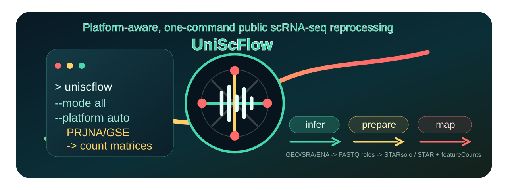
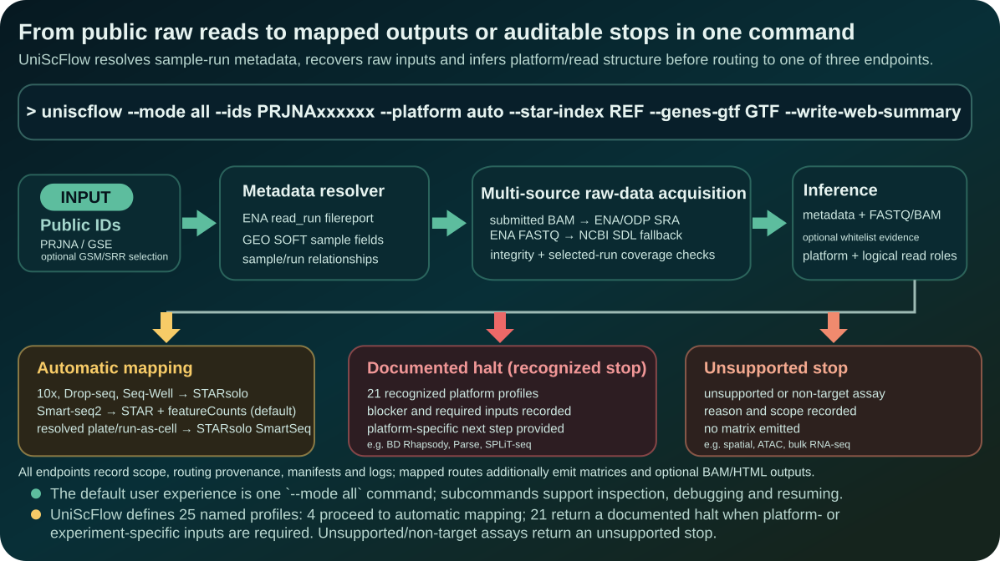
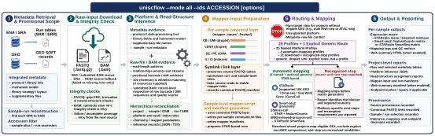
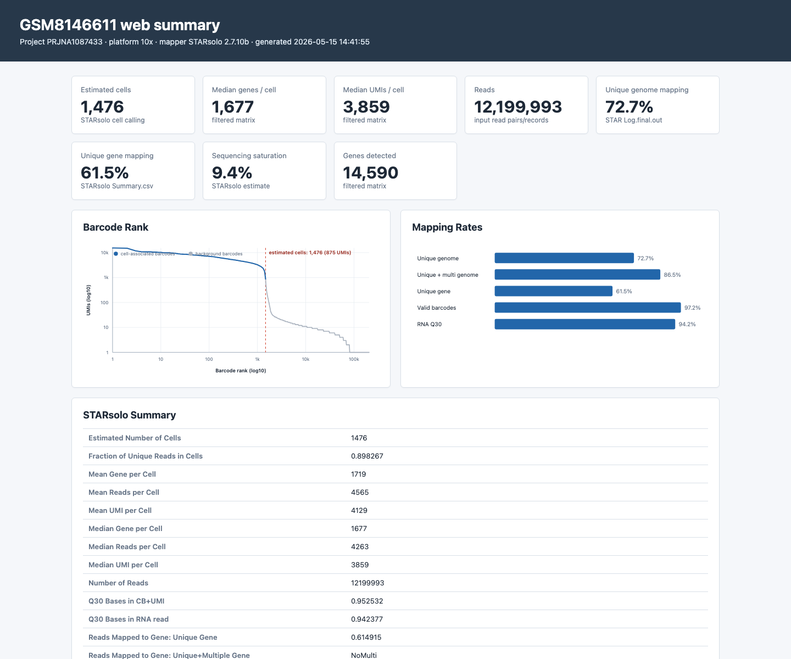

# UniScFlow: one-command, reliable automated reconstruction and remapping of public single-cell and single-nucleus RNA-seq datasets from raw reads

<p align="center">
  
</p>

[日本語版](README.ja.md)

**From a public accession to count matrices, with raw-read interpretation built in.**

`UniScFlow` reprocesses public single-cell and single-nucleus RNA-seq (sc-/snRNA-seq) data from GEO/SRA/ENA. It combines repository metadata with direct inspection of raw-read structure and sequence content to infer the platform, barcode/UMI geometry, and logical read roles. With a PRJNA or GSE accession and a suitable reference, `uniscflow --mode all` retrieves selected inputs, reconstructs mapper-ready inputs, and runs supported mapping routes in one command.

The key step is **interpreting the deposited reads**, not just downloading them or running an aligner. Numeric FASTQ suffixes need not already identify barcode, UMI, cDNA, or index reads correctly. UniScFlow reconciles the available evidence, records its assignments, and prepares the appropriate inputs for STARsolo or STAR + featureCounts. Chemistry definitions and barcode whitelists enable additional 10x chemistry-aware checks, including sample-specific layouts within a project.

Automatic mapping supports **10x Genomics, Drop-seq, Seq-Well, and Smart-seq2**. The [support matrix](#platform-support-matrix) also describes 21 resource-dependent profiles and an explicit user-configured generic droplet-UMI route. When the evidence or required resources do not support automatic mapping, UniScFlow reports the blocker and next step. Cell Ranger mapping is optional legacy support, not the default workflow.

## Start Here

| Goal | Recommended path |
| --- | --- |
| Verify an installation | Create the environment, install UniScFlow, then run `uniscflow --help` and `uniscflow --version`. Before a full run, use `--mode check` with the same paths and settings you plan to use. |
| Try a lightweight public demo | Choose the [Smart-seq2 version](docs/tutorials/quickstart_smartseq2_prjna701252.md) (three GSMs, no sample map) or the [10x version](docs/tutorials/quickstart_10x_prjna825585.md) (one GSM, with chemistry definitions and barcode whitelists). Both have Docker instructions. |
| Run your own project | Prepare a STAR index and matching GTF, choose a work volume with enough space for SRA, expanded FASTQ, and mapper outputs, and begin with a reviewed subset using `--sample-alias`. For public 10x data, Cell Ranger chemistry definitions and barcode files are strongly recommended. |
| Inspect a terminal result | Check `.uniscflow_halt_after_download.json`, `mapper_inputs_manifest.tsv`, and `mapper_run_manifest.tsv`; a zero exit can mean validated mapped output, an intentional documented halt (recognized stop), or an unsupported stop. |

The command examples below use placeholder reference and output paths. Replace every `/path/to/...` value, and keep the same metadata, download-script, raw-data, and mapper directories when resuming a staged run.

## One-Command Workflow

For supported platforms, `--mode all` is the primary workflow:

<p align="center">
  
</p>

In one command, UniScFlow resolves sample/run relationships, retrieves and validates raw inputs, infers their structure, and maps eligible samples against your reference. Manifests connect the selected accessions, input files, inferred roles, mapper commands, and outputs. When an external manifest or vendor-specific preprocessing is required, the report identifies what is missing and how to proceed.

The detailed workflow map below shows how `--mode all` expands into metadata retrieval, raw-input download and integrity checks, platform/read-structure inference, canonical mapper-input generation, routing to STAR-based mapping or a documented halt (recognized stop), and audit-ready reports.

<p align="center">
  
</p>

Not every input traverses every stage. FASTQ routes use canonical links; eligible BAM inputs with validated raw barcode/UMI tags are supplied to STARsolo as SAM streams without FASTQ conversion. Recognized stops may occur before mapper preparation and produce reports, not matrices. The other modes expose individual stages for inspection or resumption; start with `--mode all` for routine use.

## Tutorials

Start with a **Lightweight public demo**. Choose one version; you do not need to run both.

| Version | Public input and mapping | Docker |
| --- | --- | --- |
| [Smart-seq2 version](docs/tutorials/quickstart_smartseq2_prjna701252.md) | Three PRJNA701252 GSMs, each representing one cell. Automatic platform and cell-granularity inference, then STAR + featureCounts. No sample map or barcode whitelist is needed. | [Smart-seq2 Docker tutorial](docs/tutorials/docker_smartseq2_prjna701252.md) |
| [10x version](docs/tutorials/quickstart_10x_prjna825585.md) | One complete PRJNA825585 GSM with 12 runs. Automatic platform, chemistry and read-role inference, then STARsolo. Includes chemistry-definition and whitelist setup. | [10x Docker tutorial](docs/tutorials/docker_10x_prjna825585.md) |

Both versions require a mouse STAR index and matching GTF. "Lightweight" refers to the selected public input, not the memory required by a whole-genome STAR index. See the [tutorial guide](docs/tutorials/README.md) for prerequisites and output layout.

For other workflows:

| Tutorial | What it demonstrates |
| --- | --- |
| [Mixed bulk + single-cell demo](docs/tutorials/mixed_bulk_gex_prjna949947.md) | Selects two bulk GSMs and one Smart-seq2 cell from PRJNA949947 (about 0.50 GB); identifies and excludes the bulk libraries, then maps only the single-cell GEX library. [Docker version](docs/tutorials/docker_mixed_bulk_gex_prjna949947.md). |
| [Documented halt (recognized stop) demo](docs/tutorials/documented_halt.md) | Shows the expected "download + halt" behavior for platforms that need vendor manifests or experiment-specific resources before reliable mapping. |
| [Multi-project mouse tutorial](docs/examples/mouse_validation_tutorial.md) | Processes several public mouse PRJNA projects, including the PRJNA701252 mixed-platform example; runnable script: `docs/examples/mouse_validation_tutorial.sh`. |
| [Tabula Muris Senis Brain Non-Myeloid tutorial](docs/examples/tabula_muris_senis_brain_nonmyeloid_tutorial.md) | Public FASTQ download-to-mapping example outside GEO/SRA, preserving the public S3 directory layout. |

The `docs/tutorials/` pages cover installation checks and small first runs. The `docs/examples/` pages cover larger workflows. Try either lightweight demo before starting a larger example, and check its storage and reference requirements.

## Why This Exists

For any analysis that needs multiple public sc-/snRNA-seq datasets to be processed uniformly, using uploaded count matrices is not always enough. Different projects may have been mapped to different genome builds or annotation releases, processed with different tools, filtered with different cell-calling thresholds, or summarized with incompatible gene identifiers. Even when each deposited matrix is valid on its own, combining or comparing them can silently introduce gene-level inconsistencies.

Remapping raw reads against a common reference can standardize this processing. The difficult part is often upstream of alignment: resolving sample/run relationships, recovering complete inputs, distinguishing GEX from companion assays, and determining which deposited stream contains each read role.

UniScFlow focuses on automating that raw-data reprocessing layer:

- **Accession-aware selection:** resolves PRJNA/GSE projects and sample/run relationships, supports exact GSM/run filters, and retains both original and selected metadata.
- **Multi-source recovery:** checks submitted BAM availability, retrieves SRA reads, and uses ENA FASTQ or NCBI source-file fallbacks for missing runs, with integrity and selected-run coverage checks.
- **Evidence-based interpretation:** combines sample-level GEO protocols with read lengths, stream relationships, and barcode/UMI signals; supplied chemistry definitions and whitelists strengthen 10x inference.
- **Sample-aware routing:** maps explicitly identified GEX samples, excludes explicit non-GEX companions, and records unresolved assignments for review. Fully resolved mixed-platform projects can use different routes per GSM.
- **Canonical inputs without rewriting source FASTQs:** creates mapper-ready links and records source-to-role assignments. Downloaded source FASTQs are not renamed or rewritten during mapper preparation; retrieval adapters may assign local names when downloading archive files.
- **Reproducible mapping and resumption:** generates STAR-based commands, checks target outputs, and reuses completed outputs only when their recorded scope and execution context still match. Runs locally or in Docker, with optional HTML summaries.

## Installation

Clone the repository:

```bash
git clone https://github.com/KazutoTsukita/scflow-platform-workflow.git uniscflow
cd uniscflow
```

For reproducible use, record the full Git commit (`git rev-parse HEAD`) and retain the matching environment or container digest. A release tag selects a frozen release; `main` contains subsequent updates.

### Local Command

Create and activate the conda environment:

```bash
conda env create -f environment.yml
conda activate uniscflow
python3 -m pip install -e .
```

Editable installation is convenient for development. A regular `python3 -m pip install .` is also supported and installs the bundled platform profiles, runtime helper scripts, and example configuration under the environment's `share/uniscflow` directory. Run either pip command inside the environment created from `environment.yml`: pip alone installs the Python wrapper and bundled data, not STAR, SRA Toolkit, R, GNU Parallel, compression tools, or the other workflow executables.

Relative input and output paths are resolved from the current working directory. Bundled runtime helpers and platform profiles are resolved from the checkout or installed package automatically.

This installs the command:

```bash
uniscflow --help
```

The conda environment specified by `environment.yml` provides STAR/STARsolo (`2.7.10b`), `featureCounts` from Subread, `samtools`, `wget`, R packages, GNU `parallel`, SRA Toolkit, and `pigz`.

Local execution also requires Bash 4 or newer and the `flock` command from util-linux. These are normally available on current Linux systems but are not supplied by `environment.yml`; the system Bash on older macOS releases is too old and macOS does not provide `flock` by default. Use the Docker image, which includes both requirements, or install compatible host tools before a local run.

### Docker Image

To run the code and tutorials from your current checkout, build the image from that same clean checkout. This keeps the workflow code, helper scripts, and platform profiles at one source revision:

```bash
git clone https://github.com/KazutoTsukita/scflow-platform-workflow.git uniscflow
cd uniscflow
bash docker/build_current_image.sh
```

The helper requires a clean Git checkout. It builds Linux/AMD64 tags `uniscflow:latest`, `uniscflow:<version>`, and `uniscflow:<7-character-commit>`, records the full Git commit, version, and build time in OCI labels and `/workflow/UNISCFLOW_IMAGE_PROVENANCE`, and smoke-tests the CLI, offline plan, 25 profiles, bundled executables, and non-root runtime. A version string alone may not distinguish updates on `main`; verify the full source commit:

```bash
docker run --rm uniscflow:latest --version
docker image inspect uniscflow:latest \
  --format '{{ index .Config.Labels "org.opencontainers.image.revision" }}'
git rev-parse HEAD
```

The last two commands above must report the same full commit. For a minimal local build without the helper's provenance verification and smoke tests:

```bash
docker build --pull --platform linux/amd64 -t uniscflow:latest .
```

Prefer `docker/build_current_image.sh` when source provenance matters. A source rebuild fixes the checkout revision but is not bit-reproducible: upstream base images and package repositories can change.

The release workflow publishes tagged images to `ghcr.io/kazutotsukita/scflow-platform-workflow`. Use a registry image only when its corresponding release and digest have been published, and use the README/tutorials from that exact release. For the current checkout, the source build above is the direct route. Record the full OCI revision and, for published images, the registry digest; `latest` is only a convenience pointer.

The image contains UniScFlow, STAR/STARsolo, featureCounts, `samtools`, SRA Toolkit, Salmon, R, GNU Parallel, `pigz`, and the download/integrity helpers. It runs as the non-root micromamba user by default. It does not contain a genome reference or licensed Cell Ranger resources. A STAR index built from the chosen FASTA/GTF is required for STARsolo and STAR + featureCounts mapping; Salmon and optional Cell Ranger targets use their own index or reference. Cell Ranger chemistry definitions and barcode files are optional but strongly recommended for public 10x data; Cell Ranger mapping itself remains an optional legacy route using a separate Cell Ranger-capable container.

## Quick Start

### Run Everything With `--mode all`

Use `--mode all` for metadata retrieval, raw-input recovery and validation, platform/read-structure inference, mapper preparation, and mapping. Add `--write-web-summary` for HTML reports. The command below is a 10x example; the lightweight tutorials provide smaller first runs with concrete reference and resource setup.

```bash
uniscflow --mode all \
  --ids PRJNA804521 \
  --platform auto \
  --sample-alias GSM5876624,GSM5876625 \
  --filereport-dir work/filereport \
  --download-script-outputdir work/download_script \
  --temporary-sra-download-dir work/sra_tmp \
  --final-file-dir work/raw \
  --mapper-output-dir work/mapper \
  --star-index /path/to/star_index \
  --genes-gtf /path/to/genes.gtf \
  --threads 16 \
  --run-mapper-parallel 1 \
  --max-workers 6 \
  --parallel 6 \
  --cellranger-chemistry-defs /path/to/cellranger/chemistry_defs.json \
  --cellranger-barcodes-dir /path/to/cellranger/barcodes \
  --min-barcode-match-rate 0.8 \
  --inference-report-tsv work/inference_report.tsv \
  --write-web-summary
```

If `--sample-alias` is omitted, the initial scope includes all samples in the PRJNA project. Subsequent sample-level modality and platform routing can restrict mapper scope while retaining an audit record for every selected sample. For 10x datasets, Cell Ranger chemistry definitions and barcode files let UniScFlow choose the STARsolo whitelist automatically and re-check each sample's barcode/cDNA read roles while generating mapper inputs. This handles projects where all samples are 10x but different GSMs use different 10x chemistries or deposited FASTQ role layouts. For non-10x datasets, those options are harmless and are ignored unless needed.

With `--write-web-summary`, STARsolo samples get a droplet/UMI web summary, and Smart-seq2 STAR + featureCounts samples get a full-length web summary from STAR and featureCounts outputs.

Before GEX inference, UniScFlow applies a sample-level modality gate to mixed-assay projects. When at least one selected sample is explicitly GEX and another is non-GEX or unresolved, only the explicit GEX samples enter read-structure inference and mapper preparation. Explicit non-GEX companions are excluded; unresolved companions are held for review, not silently relabelled as non-GEX. `sample_modality_assignment.tsv` records each assignment and its evidence. Successful GEX mapping does not mean that unresolved companions have been resolved. If no explicit GEX scope can be established, non-GEX-only scope stops as unsupported, and unresolved scope with positive mixed-assay evidence stops for review.

For 10x Multiome deposits in which GEX and ATAC libraries are explicitly separable, UniScFlow maps the GEX component through the ordinary 10x STARsolo route and excludes the ATAC component from mapper scope. The GEX samples must still pass 10x chemistry and read-role validation; when ARC-v1 is inferred, the corresponding barcode geometry and whitelist are used. Unresolved modality assignments stop for review when no explicit GEX scope can be established.

For STARsolo GEX reports, UniScFlow separately performs a conservative, metadata-only audit for sample-multiplexing companions. A distinct explicitly annotated HTO/CMO GSM alongside a GEX GSM is reported as confirmed multiplex evidence; sample-level mentions such as `cell hashing`, `sample hashing`, `HTO`, `CMO`, or `CellPlex` without a resolvable companion are reported only as suspected. Generic `multiplexed sequencing`, pooling, CITE-seq, ADT, Feature Barcode, Cell Ranger multi, and Illumina index terminology do not trigger the warning by themselves. The multiplex assessment is warning-only and never changes mapping success, halt logic, or exit status. UniScFlow maps the eligible GEX component but does not perform HTO/CMO-based sample demultiplexing, so a flagged output may still represent pooled samples and requires manual project review.

### What `--mode all` Does

```text
1. Resolve project metadata and apply the requested sample/run filters.
2. Reuse current validated inputs; recover missing runs from supported sources.
3. Validate input integrity and complete selected-run coverage.
4. Reconcile sample-level assay metadata with raw-read evidence.
5. Infer platform, chemistry, and logical read roles for eligible samples.
6. Prepare canonical FASTQ links or eligible tagged-BAM inputs.
7. Generate and run the applicable STARsolo or STAR + featureCounts commands.
8. Validate mapper outputs and record scope-bound completion receipts.
9. Write inference records, manifests, logs, and optional HTML summaries.
```

If UniScFlow detects a manifest-dependent platform such as BD Rhapsody, Parse/Evercode, SPLiT-seq, sci-RNA-seq, CEL-seq/MARS-seq, inDrops, or related designs, `--mode all` intentionally stops after download and inference. This prevents UniScFlow from producing a plausible-looking but incorrect mapping when dataset-specific barcode or well manifest files are required.

Mapper completion is strict by default. Every SRR assigned to mapper scope must be represented by an integrity-checked FASTQ/BAM input, and every generated sample mapper must both exit successfully and produce a non-empty, structurally valid endpoint matrix; otherwise UniScFlow returns a non-zero exit status and records the missing run or failed sample in its manifests. Use `--allow-partial-success` only when incomplete sample output is explicitly acceptable, not when a complete project result is required. On rerun, already validated current-scope inputs are reused before download is attempted. An intentional `documented_halt`, `non_target_stop`, or `unsupported_stop` is a successful terminal endpoint and can exit zero without producing a matrix; `needs_review` is unresolved and returns a non-zero status.

### Interpret the Result

The term **documented halt (recognized stop)** corresponds to the internal endpoint `documented_halt`. Recognized stops and unsupported stops are distinct categories of **actionable stop**.

| Result | How to confirm it | Meaning |
| --- | --- | --- |
| Mapped | `mapper_run_manifest.tsv` records `ok` or `reused` for each mapped sample, target-specific output checks pass, and a current `.uniscflow_mapping_complete.json` receipt exists in each mapper-input directory | Mapping completed for that mapper scope. Inspect `sample_modality_assignment.tsv` and, when present, `sample_platform_routing.tsv` to distinguish mapped samples, excluded companions, and other routes. |
| Documented halt (recognized stop) | The current halt marker records `halt_type=manual_preprocessing_required` and profile-specific guidance; `halt_summary.html` may also exist | UniScFlow identified the platform but requires external manifests, barcodes, or vendor preprocessing. No matrix is claimed. |
| Unsupported stop | The halt marker records `halt_type=unsupported_platform` or `halt_type=non_target_data` | The assay is recognized but has no validated UniScFlow mapping route, or the selected scope is outside the sc-/snRNA-seq target, such as conventional bulk RNA-seq. No matrix is claimed. |
| Needs review | Blocking inference or routing records `needs_review` and the command returns non-zero | Evidence is incomplete or conflicting for the requested route. Review the recorded evidence before rerunning. Unresolved companions excluded from an explicit GEX scope are recorded separately, as described above. |
| Temporary metadata service | Exit status is `75` | ENA/GEO returned a transient or persistently malformed transport response. No biological endpoint was inferred; retry the same command later. |
| Other failure | Inspect the project log and `mapper_run_manifest.tsv` | Fix the reported input, integrity, inference, or mapper error. Do not use `--allow-partial-success` for a final matrix. |

For STARsolo droplet routes, endpoint validation checks a non-empty, structurally valid raw Gene or GeneFull matrix together with supporting logs and summaries. Raw matrix columns are barcodes, not necessarily called cells; mapping success does not guarantee a non-empty filtered-cell matrix or replace downstream cell-quality assessment. Smart-seq2 matrix columns follow the inferred cell granularity or supplied grouping map.

Persisted platform reports and halt markers are bound to the selected sample aliases, SRR accessions, filtered-filereport SHA-256, and a fingerprint of the input FASTQ/BAM paths, sizes, and modification/change times; a record from another or subsequently replaced input scope is not reused. Mapping receipts additionally bind the target, reference context, and command checksum, and outputs are revalidated before reuse. UniScFlow also holds a per-PRJNA filesystem lock for mutating commands, so accidentally launching the same project twice fails immediately instead of allowing the two processes to overwrite manifests or mapper outputs.

When multiple PRJNA/GSE IDs are supplied in one command, platform inference and mapper preparation use an independent runtime configuration for each BioProject. A platform inferred for one project is never reused as the platform of the next project.

### Optional Subcommands

These modes are useful when checking the environment, debugging a dataset, resuming a partial run, or inspecting intermediate results. They are not the main workflow.

```bash
uniscflow --mode check ...
uniscflow --mode download ...
uniscflow --mode infer-platform ...
uniscflow --mode mapping ...
uniscflow --mode report ...
```

### Run Everything With Docker

Use the locally built `uniscflow:latest` tag below, or replace it with the commit-specific tag printed by the build helper. Published commit tags should never be moved. Mount work directories read-write and the matching STAR index/GTF read-only:

```bash
docker run --rm -it \
  --user "$(id -u):$(id -g)" \
  -e HOME=/tmp \
  -v /path/to/filereport:/data/filereport \
  -v /path/to/download_script:/data/download_script \
  -v /path/to/sra_tmp:/data/sra_tmp \
  -v /path/to/raw_fastq:/data/raw_fastq \
  -v /path/to/mapper:/data/mapper \
  -v /path/to/reference:/ref:ro \
  uniscflow:latest \
  --mode all \
  --ids PRJNA804521 \
  --platform auto \
  --sample-alias GSM5876625 \
  --filereport-dir /data/filereport \
  --download-script-outputdir /data/download_script \
  --temporary-sra-download-dir /data/sra_tmp \
  --final-file-dir /data/raw_fastq \
  --mapper-output-dir /data/mapper \
  --star-index /ref/star_index \
  --genes-gtf /ref/genes.gtf \
  --threads 16
```

The image is non-root by default. Supplying the host UID/GID explicitly also keeps files written to mounted work directories owned by the invoking host user; `HOME=/tmp` gives that numeric user a writable home for tools that create per-user configuration or cache files. Allow enough free disk for SRA, expanded FASTQ, STAR temporary files, and mapper outputs; these can coexist during a run.

Add `--ftp-proxy` only when your network requires it:

```bash
--ftp-proxy proxy.example.ac.jp:8080/
```

## Modes

`all` is the primary mode. The other modes expose pieces of the workflow for debugging, auditing, resuming interrupted runs, or building references.

| Mode | Role | Description |
| --- | --- | --- |
| `all` | Primary workflow | Retrieve and validate inputs, infer platform/read roles, and run eligible mapping routes or report an actionable stop. HTML summaries are optional. |
| `check` | Support | Check required commands, packages, runtime helpers, and mapping settings before a full run. |
| `plan` | Support | Print the commands that would be executed without launching workflow stages. Configured directories may be created, and a GSE input may require GEO metadata resolution and cache writes. |
| `download` | Support | Run metadata retrieval, multi-source input recovery, integrity checks, and platform/read inference without mapping. Inspect inputs and inference records before mapper preparation. |
| `infer-platform` | Support | Re-run platform inference from existing metadata and raw inputs. |
| `infer-reads` | Support | Infer FASTQ read roles from an existing `SRR*_[0-9].fastq.gz` directory. |
| `prepare` | Support | Generate mapper inputs, scripts, and manifests from existing FASTQs or eligible tagged BAMs without running mapping. |
| `mapping` | Support | Prepare and run mapper scripts from existing inputs using the selected route. Does not download raw data. |
| `report` | Support | Generate `web_summary.html` reports from existing STARsolo or STAR + featureCounts mapper outputs. |
| `validate` | Support | Check input readiness, including metadata, generated scripts, raw-input directories, and selected-run coverage. |
| `build-star-index` | Utility | Build a STAR genome index from FASTA and GTF files. |

Shortcut flags are also available:

```bash
--modecheck
--modedownload
--modemapping
--modeall
```

## Common Options

This table covers the options most readers need. Run `uniscflow --help` for the authoritative, exhaustive CLI reference.

| Option | Purpose |
| --- | --- |
| `--ids` | PRJNA or GSE project IDs. The `PRJNA` prefix is optional for BioProject IDs. GSE IDs are resolved only from explicit GEO SOFT BioProject relation fields. |
| `--sample-alias` | GSM filter. Omit to select the full initial project scope; modality/platform routing may subsequently restrict mapper scope. Use commas for multiple GSMs. |
| `--sample-map-tsv` | Optional grouping table for plate/full-length projects. GSM column: `gsm_accession`, `gsm`, `sample_alias`, or `geo_accession`. Biological-sample column: `sample_id`, `biological_sample`, `sample_name`, `group_id`, or `sample`. Optional cell/well column: `cell_id`, `well_id`, `well`, `cell`, or `library_id`. Optional condition column: `condition`, `treatment`, or `group`. |
| `--run-accession` | Exact run-accession filter, such as an SRR or ERR accession. |
| `--filter` | Additional ENA metadata filter as `key=value`. Can be repeated. |
| `--filereport-dir` | Directory for ENA metadata outputs. |
| `--download-script-outputdir` | Directory for generated SRA download scripts. |
| `--temporary-sra-download-dir` | Temporary directory for SRA files and intermediate FASTQs. |
| `--final-file-dir` | Raw-input directory for downloaded FASTQs and submitted BAMs. Mapper preparation leaves source FASTQs unchanged and creates canonical links separately under `--mapper-output-dir`. |
| `--max-workers` | Number of parallel `fasterq-dump` workers. |
| `--parallel` | Parallelism used by download, conversion, and compression steps. |
| `--ftp-proxy` | Optional FTP proxy. Leave unset unless required by your network. |
| `--platform` | Use `auto` to reconcile metadata and raw-read evidence, or request a named platform such as `10x`, `dropseq`, or `smartseq2`. An explicit request is still checked against the evidence. |
| `--force-platform` | Expert override for metadata/FASTQ conflicts. It can clear a non-Flex halt but does not supply missing manifests or vendor resources and is not evidence of valid mapping. The dedicated `10x_flex` protection cannot be cleared this way. |
| `--generic-cell-barcode-read`, `--generic-cell-barcode-start`, `--generic-cell-barcode-length`, `--generic-umi-read`, `--generic-umi-start`, `--generic-umi-length`, `--generic-cdna-read` | Complete explicit geometry for `--platform generic_droplet_umi`. All seven options are required. The cell barcode and UMI must be non-overlapping intervals on the same logical read; cDNA must use the other logical read. UniScFlow never infers these values automatically. |
| `--resolve-bam` | Enabled by default. If ENA/GEO reports submitted BAM/alignment files instead of raw split FASTQs, UniScFlow downloads those BAMs directly, inspects barcode/UMI SAM tags, and generates STARsolo-from-BAM rescue scripts when complete raw barcode/UMI sequence and quality tags are available (standard `CR/CY/UR/UY`, or provenance-qualified legacy Cell Ranger `CR/CQ/UR/UQ`). |
| `--no-resolve-bam` | Disable the initial submitted-BAM rescue detection. SRA retrieval and missing-run source fallbacks remain available. |
| `--bam-integrity-check` | BAM validation before accepting submitted BAM rescue files. `full` runs `samtools view -c` and catches CRC/inflate errors; `quickcheck` is faster but weaker. Default: `full`. Validation fails closed when `samtools` is unavailable. ENA byte counts and MD5 are also checked when provided. |
| `--bam-integrity-retries` | Extra download attempts for a submitted BAM that fails integrity validation. Default: `2`. |
| `--fastq-integrity-check` | Validation before accepting directly downloaded FASTQ.gz fallback files from ENA `fastq_ftp` or NCBI SDL source files. `gzip` reads the whole compressed file and catches gzip CRC/truncation errors; ENA byte counts and MD5 are checked when available. `none` disables the gzip scan. Default: `gzip`. |
| `--fastq-integrity-retries` | Extra download attempts for a directly downloaded FASTQ.gz file that fails integrity validation. Default: `2`. |
| `--profiles-dir` | Directory containing platform profile JSON files. Advanced option; defaults to the bundled `profiles/platforms`. |
| `--geo-soft-max-samples` | Leading GSMs used for the initial GEO metadata summary; default `3`. This is not a cap on selected-sample evidence checks. |
| `--geo-soft-dir` | Optional GEO SOFT cache directory; defaults to `<filereport-dir>/geo_soft`. |
| `--target` | Target for `--mode prepare`. Executable, validated mapper targets are `starsolo`, `star_featurecounts`, `cellranger`, and `salmon`; `auto` selects the profile default. `manual_review` is a non-executable preparation target that writes review artifacts instead of a mapper command. An explicit target takes precedence over `--mapping-engine`; the explicit legacy Cell Ranger engine selects its Docker route. Platform profiles list external ecosystem suggestions separately as `external_targets`; selecting one does not silently generate a placeholder command. |
| `--mapper-output-dir` | Output directory for platform-aware mapper scripts and manifests. |
| `--star-index`, `--salmon-index` | Mapper indexes used when generating STARsolo, STAR + featureCounts, or optional Salmon scripts. |
| `--genome-fasta`, `--genes-gtf`, `--sjdb-overhang` | Inputs for `--mode build-star-index`. `--sjdb-overhang` defaults to `99`; `--genes-gtf` is also used by Smart-seq2 STAR + featureCounts mapping. |
| `--starsolo-whitelist` | Optional barcode whitelist override for generated STARsolo scripts. For 10x datasets, UniScFlow can auto-select this from the inferred Cell Ranger chemistry when `--cellranger-chemistry-defs` and `--cellranger-barcodes-dir` are provided. |
| `--mapping-engine` | Mapping runner family for `--mode mapping`. Default `starsolo` runs generated scripts, including STARsolo and STAR + featureCounts targets; `cellranger` with `--target auto` selects the optional legacy Docker route. An explicit `--target cellranger` instead generates a mapper script and requires a host-accessible `cellranger` executable. |
| `--run-mapper-parallel` | Number of generated mapper scripts to run in parallel. |
| `--allow-partial-success` | Explicitly permit a project command to return success when at least one sample mapper succeeds and others fail. Default is strict all-sample success. |
| `--no-bam` | Do not emit mapper BAM output. In the default `auto` policy, STARsolo targets avoid BAM output, while STAR + featureCounts writes only the temporary BAM it needs for counting and removes it after count generation. |
| `--with-bam` | Keep mapper BAM output when supported, including STARsolo targets that otherwise default to count-only output and STAR + featureCounts temporary BAMs that would otherwise be removed. |
| `--write-web-summary` | Generate `web_summary.html` reports after mapping when STARsolo or STAR + featureCounts outputs are present. |
| `--report-name` | File name for generated HTML reports. Default is `web_summary.html`. |
| `--no-logo` | Do not print the UniScFlow startup logo. The logo is terminal-only and is not written to project logs. |
| `--version` | Print the installed UniScFlow version. |
| `--index1`, `--index2`, `--read1`, `--read2` | Manual FASTQ suffix-to-role mapping. Use `NULL` for a missing index read. |
| `--cellranger-chemistry-defs` | Cell Ranger `chemistry_defs.json` for 10x chemistry-aware inference. |
| `--cellranger-barcodes-dir` | Barcode whitelist directory for 10x chemistry-aware inference. |
| `--min-barcode-match-rate` | Minimum barcode-match rate for chemistry/read-role inference; default `0.5`. Examples using `0.8` deliberately require a stricter match. Other scope, assay, and geometry checks still apply. |
| `--cellranger-chemistry` | Restrict inference to one or more Cell Ranger chemistry names. Can be repeated. |
| `--cellranger-include-introns` | Optional explicit `true` or `false` value for legacy `cellranger count`. If omitted, Cell Ranger uses its version-specific default. |
| `--inference-report-tsv` | Append per-FASTQ details when the project-level 10x read-inference path emits them. This is not an all-platform inference log; deferred non-10x routes write per-sample assignment files instead. |
| `--cellranger-container` | Existing Docker container with Cell Ranger installed. |
| `--transcriptome` | Cell Ranger reference path inside the Cell Ranger container. |
| `--localcores`, `--localmem` | Cell Ranger compute settings. |
| `--config` | TOML configuration path. The bundled example is already the default; from a checkout, `./config/example.toml` is available as a template. |
| `--dry-run` | Print planned actions without launching workflow stages. Configured directories may still be created, and GSE resolution may download and cache metadata. |
| `--help` | Show the complete current option reference. |

Different metadata filter keys are combined with **AND**. Comma-separated values within one filter are combined with **OR**. Repeating the same key keeps only its final value. Accession fields, including GSM/sample aliases and SRR run accessions, use case-insensitive exact matching so that `GSM1` cannot select `GSM10`; free-text fields such as `sample_title` use case-insensitive fixed-string matching. Unknown columns and malformed filters stop before download.

## Platform Support Matrix

UniScFlow currently defines 25 named platform routing profiles. It also provides one explicitly configured generic droplet-UMI route, which is a user-supplied geometry rather than a platform profile. The table separates automatic mapping, resource-dependent documented halts (recognized stops), and recognized unsupported assays.

| Level | Platforms/profiles | Current support |
| --- | --- | --- |
| Automatic mapping | Named platforms: `10x`, `dropseq`, `seqwell`, `smartseq2`; optional user-configured route: `generic_droplet_umi` with a complete explicit geometry | Generates and runs mapper scripts/manifests. 10x, Drop-seq, Seq-Well, and the explicitly configured generic droplet-UMI route target STARsolo by default. For 10x, mapper preparation can re-infer chemistry/read roles per sample and normalize each GSM into canonical STARsolo `R1` barcode/UMI and `R2` cDNA FASTQ names. Default Smart-seq2 STAR + featureCounts mapping undergoes a scope-matched granularity audit: GSM-as-cell inputs use STAR + featureCounts, while reviewed sample-map groups and automatically classified run-as-cell inputs use STARsolo SmartSeq; ambiguous layouts halt. An explicitly selected Salmon target bypasses this granularity routing and must be used only after manual confirmation of GSM/cell/sample semantics. Cell Ranger remains available as an optional 10x legacy target. |
| Documented halt (recognized stop) | `hive_clx`, `bdrhapsody`, `bdrhapsody_targeted_panel`, `dnbelab_c4`, `parse`, `splitseq`, `scirnaseq`, `celseq2`, `marsseq`, `indrop`, `scrbseq`, `smartseq3`, `microwellseq`, `singleron_gexscope`, `seekone`, `mobidrop_mobicube`, `fluidigm_c1`, `icell8`, `ramda_seq`, `quartz_seq`, `pipseq` | Downloads data and records platform inference, then writes a halt marker because dataset-specific barcode geometry, well/sample maps, vendor preprocessing, or manifest files are required before reliable mapping. Each marker includes a profile-specific blocker, required inputs, concrete next steps, recommended workflow, and explicit resume condition; the CLI and halt web summary display the same guidance. In the standard CLI, later `prepare` or `mapping` steps skip these samples while the halt marker is present. See [documented halt (recognized stop) profiles: what to do next](docs/recognized_halt_next_steps.md). |
| Unsupported stop | Recognized non-target or unsupported assays, including conventional bulk RNA-seq, targeted transcriptomics, Stereo-seq/spatial transcriptomics, ddSEQ, and ATAC-only or other epigenomic inputs | Records the exact selected scope and evidence, writes a halt marker, and stops without mapper output. The reader-facing result is an unsupported stop; internal records distinguish `non_target_stop` (`halt_type=non_target_data`) from `unsupported_stop` (`halt_type=unsupported_platform`). |

PIP-seq is recognized as `pipseq`, but UniScFlow does not replace PIP-seq chemistry-specific barcode processing with generic STARsolo settings. Use PIPseeker-compatible processing with the exact chemistry/barcode resources, then carry the validated matrix into downstream analysis.

10x Flex is a dedicated protected halt route rather than an ordinary 10x STARsolo route. It requires the matching probe set and sample/probe-barcode configuration together with `cellranger multi` or another validated probe-aware workflow. `--force-platform` cannot clear this protection.

Stereo-seq is recognized as the non-profile routing label `spatial_transcriptomics`. Under `--platform auto`, each selected GSM must contain sample-level Stereo-seq/STOmics assay evidence together with matching `SAW`, `Stereo-seq Analysis Workflow`, or `Stereopy` processing/output evidence. Uppercase unversioned `SAW` is accepted; assay-only, processing-only, lowercase ordinary `saw`, Series-only, or partial-scope evidence is insufficient. A confirmed route ends as `unsupported_stop` with `halt_type=unsupported_platform`; UniScFlow does not generate mapper output.

Plate-based library-construction names can also appear in bulk RNA-seq deposits. For every plate-family profile, UniScFlow therefore applies a high-specificity non-target guard after identifying the technology: explicit assay declarations such as `bulk RNA-seq`, `bulk, RNA-seq`, `bulk 3'-end RNA-seq`, `bulk 3-prime RNA-seq`, or `bulk transcriptome/transcriptomics` route to `non_target_bulk_rna`. A sample-level declaration is sufficient; a Series-level declaration must additionally be supported by sample-indexing evidence such as a gene-by-sample matrix, sample barcodes, or per-sample demultiplexing. UniScFlow also applies the same patterns when the platform name remains unresolved but the FASTQs are classified as plate/full-length-like: this FASTQ-gated route requires transcriptomic RNA-seq metadata, no supported barcode/UMI geometry, explicit bulk RNA-seq evidence, and no sample- or Series-level single-cell evidence. It never overrides an inferred non-plate platform. The inferred plate technology, when available, is retained as `technology_candidate` in the report and halt marker, but no mapper command or count matrix is generated. Generic mentions of `bulk`, homogenized tissue, FACS sorting, low input, or a platform comparison do not trigger this cross-platform veto by themselves.

For DNBelab C4/C Series-style 3' scRNA-seq, UniScFlow requires both metadata evidence such as DNBelab C4, DNBSEQ/DIPSEQ, PISA, or DNBC4Tools and FASTQ evidence for a DNBelab-like barcode/UMI read before selecting the `dnbelab_c4` profile automatically. This is a platform-aware routing decision, not a default automatic mapping path: DNBelab/PISA-compatible barcode correction and preprocessing can be required, so `--mode all` stops after download with an audit-friendly halt marker instead of generating STARsolo commands directly. Product-family wording alone is treated cautiously.

Honeycomb Biotechnologies HIVE CLX deposits are recorded as `hive_clx` when HIVE CLX or BeeNet evidence is present. Although some deposits describe the commercial assay as a Seq-Well platform, UniScFlow does not route HIVE CLX through the ordinary Seq-Well STARsolo profile: BeeNet-compatible vendor preprocessing and barcode geometry are required, so `--mode all` writes a documented manual-preprocessing halt.

BD Rhapsody targeted-expression deposits are recorded as `bdrhapsody_targeted_panel` only when every selected GSM independently identifies the BD Rhapsody Immune Response Panel, a targeted workflow, and an explicit numeric gene/transcript scope, with no WTA evidence. This narrow subtype remains a documented halt (recognized stop) and requires the exact panel and custom-primer targets, matching BD barcode/reference resources, sample-tag or AbSeq definitions when used, and the BD Rhapsody Targeted Analysis Pipeline. Generic targeted-PCR wording alone, including V(D)J enrichment, never triggers this route.

For Singleron GEXSCOPE/SCOPE-chip datasets, UniScFlow detects metadata terms such as Singleron, GEXSCOPE, SCOPE-chip, or GEXSCOPE Single-Cell RNA Library Kit. These datasets are treated as vendor-specific droplet UMI data: public FASTQs can appear as 150 bp paired-end reads, while barcode/UMI extraction and poly-A/adapter handling are part of the Singleron preprocessing workflow. UniScFlow therefore records the platform and stops after download until a validated Singleron preprocessing path is supplied.

For manifest-dependent or vendor-preprocessed platforms such as HIVE CLX/BeeNet, BD Rhapsody, DNBelab C4/C Series, Parse/Evercode, SPLiT-seq, sci-RNA-seq, CEL-seq/MARS-seq, inDrops, SCRB-seq, Microwell-seq, SeekOne, and Smart-seq3, `--mode all` normally stops after download and platform inference. UniScFlow writes `.uniscflow_halt_after_download.json` under the project FASTQ directory and avoids generating mapper commands rather than producing a misleading result. An active marker makes later `prepare` and `mapping` steps skip the affected scope; adding resource files does not clear it automatically. Profiles with `resume_mode=external_workflow` finish in the named external pipeline. A `manual_review_then_uniscflow` profile can continue only after review with `--force-platform` and an explicit supported mapper target, as directed by its marker. The lower-level mapper-input helper can also be run manually with a manual-review target/profile to create review artifacts and source-role symlink FASTQs when possible.

Ordinary UMI-bearing Smart-seq3 remains a documented halt (recognized stop). Under `--platform auto` only, a modified Smart-seq3 protocol may use the Smart-seq2 computational backend when every selected GSM passes the narrow non-UMI, one-cell-per-well, complete-input, and no-competing-assay checks. Otherwise the Smart-seq3 halt is retained.

In each profile, `supported_targets` contains only targets for which UniScFlow can generate an executable command and validate its endpoint. Related vendor or third-party pipelines that may be appropriate after manual preprocessing are recorded separately as `external_targets`.

When a non-droplet platform other than Smart-seq2 is inferred and at least 96 GSM/sample aliases are selected, UniScFlow emits a bold warning in the project log. In `--mode all`, it stops after download so the metadata can be reviewed before mapping. Smart-seq2 is exempt from this generic stop because its default STAR + featureCounts route performs the post-inference granularity audit described above. An explicit Smart-seq2 Salmon target bypasses that routing and therefore requires manual confirmation of GSM/cell/sample semantics. Many plate or well-indexed public datasets assign one GSM to one well/cell rather than one biological sample, so the GEO/SRA metadata should be inspected manually before interpreting sample-level outputs. After review, either rerun `uniscflow --mode mapping` explicitly or provide `--sample-map-tsv` so UniScFlow can group GSM/well outputs by biological sample.

For a BioProject that mixes platform families, a sample-level route succeeds only when every selected GSM has exactly one complete, non-overlapping endpoint and none remains `needs_review`. Mapper commands are generated only for `automatic_mapping` samples; `documented_halt`, `non_target_stop`, and `unsupported_stop` samples remain explicit terminal endpoints. Duplicate, overlapping, incomplete, or needs-review plans halt and require narrower selection or additional evidence. If all selected samples are 10x but individual GSMs have different chemistries or deposited read-role layouts, sample-level 10x inference can normalize them automatically during mapper preparation.

## Prerequisites

### STAR Index From Your FASTA/GTF

STARsolo and STAR + featureCounts mapping need a STAR genome index and matching GTF. Build the index once from the genome FASTA and gene annotation GTF you want to use for uniform reprocessing. Salmon and optional Cell Ranger targets instead use their own transcriptome indexes or references.

```bash
uniscflow --mode build-star-index \
  --star-index /path/to/star-index \
  --genome-fasta /path/to/genome.fa \
  --genes-gtf /path/to/genes.gtf \
  --threads 16
```

For a 10x-style reference directory, the inputs often look like this:

```bash
uniscflow --mode build-star-index \
  --star-index /path/to/star-mm10-2020-A \
  --genome-fasta /path/to/refdata-gex-mm10-2020-A/fasta/genome.fa \
  --genes-gtf /path/to/refdata-gex-mm10-2020-A/genes/genes.gtf \
  --threads 16
```

By default, UniScFlow uses `--sjdb-overhang 99` when building a STAR index. This is a practical default for general-purpose public scRNA-seq reprocessing. STAR recommends `read_length_minus_1` for a dataset-specific optimized index, so advanced users can still override it explicitly. After building the index, pass the same paths to `--mode all`:

```bash
--star-index /path/to/star-mm10-2020-A
--genes-gtf /path/to/refdata-gex-mm10-2020-A/genes/genes.gtf
```

`build-star-index` records SHA-256 provenance for the FASTA and GTF in `uniscflow_star_index_manifest.json`. It holds an output-specific lock, builds and validates the complete index in a temporary sibling directory, and only then promotes it to the configured path; a failed rebuild leaves the prior index intact. Before STAR-based mapping, UniScFlow checks `--genes-gtf` against this record. For an index built directly with STAR, UniScFlow instead hashes the GTF recorded as `sjdbGTFfile` in `genomeParameters.txt` when that file remains available. Only a demonstrated GTF hash mismatch is a hard error. Missing, unreadable, or stale provenance is not equated with an annotation mismatch: UniScFlow reports index-versus-GTF gene-ID overlap, continues with an explicit `star_index_annotation_provenance_unverified` warning, and carries that warning into mapper profiles and generated web summaries. Rebuilding the index with UniScFlow remains recommended for fully auditable production analyses.

STAR may open thousands of temporary files while sorting BAM output. UniScFlow attempts to raise the open-file soft limit to `65536` before running generated mapper scripts and prints a warning if the effective limit remains below `4096`. On systems with a restrictive shell configuration, run `ulimit -n 65536` before starting mapping.

### Optional But Recommended: Cell Ranger Chemistry And Barcode Files

Cell Ranger is not required for UniScFlow's default STAR-based mapping. However, for public 10x datasets, providing Cell Ranger's `chemistry_defs.json` and barcode inclusion lists substantially improves read-structure and chemistry inference. UniScFlow uses these files to test sampled FASTQ barcode reads against chemistry-specific barcode lists and to auto-select the matching STARsolo whitelist.

During STARsolo script generation, UniScFlow checks each barcode-read FASTQ stream against the CB/UMI end required by the selected profile. Streams with at least 90% usable sampled reads proceed normally; 70% to less than 90% retain a short-barcode-read warning. Below 70%, sampling expands to 1,000, 5,000, and 10,000 reads per FASTQ. A persistent shortfall stops mapping unless the guarded shortened-UMI path below applies. Longer reads are valid and do not by themselves imply a different chemistry. Per-FASTQ whitelist-match warnings are retained when aggregate chemistry inference remains actionable; warnings appear in the mapper profile and optional HTML summary.

**Uniformly shortened 10x UMIs:** for supported SC3Pv3, SC3Pv4, `SC5P-R2-v3`, and `ARC-v1` definitions, UniScFlow can use an observed UMI length below the nominal length only if the supplied chemistry explicitly permits it through `min_length`. This requires a complete 16-base barcode, a simple R1 barcode/UMI plus R2 cDNA layout, sufficient whitelist matching in every barcode FASTQ, and a full-file scan confirming the same read length across all barcode streams for that sample. The effective geometry is recorded without changing source FASTQs or chemistry definitions. A `shortened_umi` warning notes that fewer UMI bases can increase molecular collisions; mixed lengths or unsupported geometries do not qualify.

10x Flex/Fixed RNA Profiling chemistries (`MFRP-*` and `Flex-v2-*`) are recorded as the `10x_flex` routing subtype. They are not sent to STARsolo: UniScFlow downloads and organizes the public inputs, writes a documented halt (recognized stop), and requires a matching probe set plus sample/probe-barcode configuration for a dedicated Cell Ranger `multi` workflow.

UniScFlow needs only these Cell Ranger resource files:

| Required resource | Typical location after unpacking Cell Ranger | Used for |
|---|---|---|
| `chemistry_defs.json` | `cellranger-x.y.z/lib/python/cellranger/chemistry_defs.json` | Defines Cell Ranger chemistry names, read roles, barcode lengths, offsets, and whitelist file names. |
| `barcodes/` directory | `cellranger-x.y.z/lib/python/cellranger/barcodes/` | Contains 10x barcode inclusion lists such as `3M-february-2018*.txt.gz`, `737K-august-2016*.txt`, and ARC/ATAC/GEX whitelist files. |

Copy the entire `barcodes/` directory, not only one whitelist file. Public deposits may come from different 10x generations, and UniScFlow compares candidate chemistries against the matching barcode list.

Download Cell Ranger from the official 10x Genomics download page, accept the 10x license terms, and unpack the tarball. For up-to-date versions, file names, and download URLs, always check the Cell Ranger website:

https://www.10xgenomics.com/support/software/cell-ranger/downloads

```bash
mkdir -p "$HOME/cellranger_download"
cd "$HOME/cellranger_download"

# Before this block, export the current signed URL shown by the 10x website.
# For example: export CELLRANGER_URL='<current signed Cell Ranger URL>'
: "${CELLRANGER_URL:?Set CELLRANGER_URL to the current signed URL from 10x}"

wget -O cellranger-10.0.0.tar.gz "$CELLRANGER_URL"
tar -xzvf cellranger-10.0.0.tar.gz
```

After unpacking Cell Ranger 10.0.0, the two UniScFlow inputs are:

```text
cellranger-10.0.0/lib/python/cellranger/chemistry_defs.json
cellranger-10.0.0/lib/python/cellranger/barcodes/
```

For another Cell Ranger version, replace `10.0.0` with the downloaded version. For example:

```text
cellranger-x.y.z/lib/python/cellranger/chemistry_defs.json
cellranger-x.y.z/lib/python/cellranger/barcodes/
```

For convenience, copy the required files into a small stable directory:

```bash
CELLRANGER_HOME="$HOME/cellranger_download/cellranger-10.0.0"

mkdir -p "$HOME/cellranger_v10_for_scflow/barcodes"
cp "$CELLRANGER_HOME/lib/python/cellranger/chemistry_defs.json" \
  "$HOME/cellranger_v10_for_scflow/chemistry_defs.json"
cp -R "$CELLRANGER_HOME/lib/python/cellranger/barcodes/." \
  "$HOME/cellranger_v10_for_scflow/barcodes/"

CELLRANGER_CHEMISTRY_DEFS="$HOME/cellranger_v10_for_scflow/chemistry_defs.json"
CELLRANGER_BARCODES_DIR="$HOME/cellranger_v10_for_scflow/barcodes"

ls "$CELLRANGER_CHEMISTRY_DEFS"
ls "$CELLRANGER_BARCODES_DIR"
```

If your Cell Ranger package uses a different internal layout, locate the files first:

```bash
find "$CELLRANGER_HOME" -name chemistry_defs.json
find "$CELLRANGER_HOME" -type d -name barcodes
```

The prepared resource directory should look like this:

```text
$HOME/cellranger_v10_for_scflow/
  chemistry_defs.json
  barcodes/
    3M-february-2018.txt.gz
    3M-february-2018_TRU.txt.gz
    737K-august-2016.txt
    ...
```

Use these options in `--mode all`:

```bash
--cellranger-chemistry-defs "$CELLRANGER_CHEMISTRY_DEFS"
--cellranger-barcodes-dir "$CELLRANGER_BARCODES_DIR"
--min-barcode-match-rate 0.8
```

These files are used only as inference/whitelist resources. UniScFlow does not run Cell Ranger in the default STAR-based workflow and does not redistribute Cell Ranger or 10x barcode files.

### Optional For Plate Projects: Sample Map TSV

Most droplet datasets use one GSM/sample alias for one biological sample. In contrast, plate or full-length scRNA-seq projects, especially Smart-seq2, may deposit one GSM for each well, cell, or library. In that situation, the public BioProject can contain dozens to thousands of GSM directories, but the analysis should usually be summarized by biological sample.

No sample map is required for automatic cell-level mapping: clearly classified GSM-as-cell deposits use STAR + featureCounts, and run-as-cell deposits use STARsolo SmartSeq. Use `--sample-map-tsv` if you want to organize GSM/cell outputs into reviewed biological sample groups. UniScFlow then writes one sample-level STARsolo SmartSeq manifest and one mapping command per `sample_id`, retaining separate cell columns. It does not infer biological replicate groups; ambiguous cell granularity halts instead of guessing.

The file must be a tab-delimited TSV. It needs one GSM/sample-alias column and one biological sample column.

Accepted GSM column names:

```text
gsm_accession
gsm
sample_alias
geo_accession
```

Accepted biological sample column names:

```text
sample_id
biological_sample
sample_name
group_id
sample
```

Optional cell/well column names:

```text
cell_id
well_id
well
cell
library_id
```

Optional condition column names:

```text
condition
treatment
group
```

Minimal example:

```tsv
gsm_accession	sample_id	cell_id	condition
GSM000001	treated_mouse_1	A01	treated
GSM000002	treated_mouse_1	A02	treated
GSM000003	control_mouse_1	A01	control
GSM000004	control_mouse_1	A02	control
```

In this format example, `GSM000001` and `GSM000002` are separate cells/wells belonging to `treated_mouse_1`. The output directory is grouped by `sample_id`:

```text
<mapper-output-dir>/prjna<ID>/
  sample_groups.tsv
  treated_mouse_1/
    sample_map.tsv
    mapper_inputs/starsolo/
      read_files_manifest.tsv
      command.sh
      starsolo_out/Solo.out/Gene/
      starsolo_out/Solo.out/GeneFull/
  control_mouse_1/
    sample_map.tsv
    mapper_inputs/starsolo/
      read_files_manifest.tsv
      command.sh
      starsolo_out/Solo.out/Gene/
      starsolo_out/Solo.out/GeneFull/
```

For your own reviewed map, replace the placeholder accession below and provide `sample_map.tsv` covering the selected GSMs. For a concrete three-cell example, see the [optional grouping section of the Smart-seq2 tutorial](docs/tutorials/quickstart_smartseq2_prjna701252.md#optional-group-cells-with-a-sample-map).

```bash
uniscflow --mode all \
  --ids PRJNAxxxxxx \
  --platform auto \
  --sample-map-tsv sample_map.tsv \
  --filereport-dir work/filereport \
  --download-script-outputdir work/download_script \
  --temporary-sra-download-dir work/tmp_sra \
  --final-file-dir work/raw \
  --mapper-output-dir work/mapper_ready \
  --star-index /path/to/star_index \
  --genes-gtf /path/to/genes.gtf \
  --threads 16 \
  --write-web-summary
```

If `--sample-map-tsv` is supplied, every selected GSM directory must be present in the table. This strict check prevents accidental mixing of one-well-per-GSM records and true biological samples. For mixed BioProjects, first select the plate/full-length subset with `--sample-alias`, run it with `--sample-map-tsv`, and then run the remaining subset separately with `--platform auto`.

## Output Files

The following files are written under the configured directories when applicable to the selected route. A stopped route does not produce mapper output, and BAM routes do not require a canonical FASTQ layer.

Metadata and download records:

- **Raw ENA metadata**
  - Path: `<filereport-dir>/filereport_read_run_PRJNA<ID>_raw_tsv.txt`
  - Unfiltered ENA read_run metadata. Useful for auditing what ENA returned before sample filtering.
- **Selected ENA metadata**
  - Path: `<filereport-dir>/filereport_read_run_PRJNA<ID>_tsv.txt`
  - Filtered ENA metadata defining the selected download scope. Subsequent modality/platform routing can narrow mapper scope; inspect the corresponding assignment reports.
- **Spreadsheet metadata**
  - Path: `<filereport-dir>/PRJNA<ID>.csv`
  - CSV version of the selected metadata for spreadsheet inspection.
- **Platform inference JSON**
  - Path: `<filereport-dir>/platform_inference_PRJNA<ID>.json`
  - Platform inference record, including metadata/FASTQ calls, selected platform, evidence, and halt decisions.
- **GEO SOFT cache**
  - Path: `<filereport-dir>/geo_soft/`
  - Cached GEO SOFT records used for metadata-based platform inference.
- **Generated download script**
  - Path: `<download-script-outputdir>/filereport_read_run_PRJNA<ID>_tsv_download_srr.sh`
  - Generated SRA download script for reproducibility and manual inspection.
- **Project log**
  - Path: `<temporary-sra-download-dir>/prjna<ID>/prjna<ID>_log.txt`
  - Project-level run log, including download progress, inference messages, warnings, and halt actions.

Raw FASTQs and read-structure records:

- **Sample FASTQ directory**
  - Path: `<final-file-dir>/prjna<ID>/<sample_alias>/`
  - Sample-level FASTQ directory after metadata filtering, with local names such as `SRRxxxx_1.fastq.gz`. These downloaded files are not renamed or rewritten during mapper preparation; archive basenames and adapter-assigned local names need not be identical.
- **Read-structure assignment TSV**
  - Path: `<final-file-dir>/prjna<ID>/read_structure_assignment.tsv` for uniform project-level routes, or `<final-file-dir>/prjna<ID>/<sample_alias>/read_structure_assignment.tsv` for deferred non-10x routes
  - Assignment from canonical logical roles (`I1`, `I2`, `R1`, `R2`) to source FASTQ suffixes. Its scope is route-dependent. Mapper preparation uses the applicable file to build canonical symlinks without renaming raw FASTQs.
- **Read-structure assignment JSON**
  - Path: `<final-file-dir>/prjna<ID>/read_structure_assignment.json` for uniform project-level routes; deferred non-10x routes instead write `<final-file-dir>/prjna<ID>/<sample_alias>/read_structure_inference.json`
  - JSON record of the applicable assignment and inference evidence for programmatic inspection.
- **SRR FASTQ rearrangement manifest**
  - Path: `<final-file-dir>/prjna<ID>/srr_fastq_rearrangement.tsv`
  - Records how downloaded SRR FASTQs were assigned into GSM/sample directories while preserving source file names. It includes source/destination device, inode, size, mtime, and ctime fingerprints. When a FASTQ was already fully validated and a same-filesystem move preserves device/inode, size, and mtime, the post-rearrangement coverage check verifies the move manifest and destination ctime and safely reuses the prior result instead of expanding the whole FASTQ again. Copies across filesystems, replacement, or any fingerprint change trigger full validation.

BAM rescue inputs:

- **BAM rescue manifest**
  - Path: `<final-file-dir>/prjna<ID>/bam_inputs_manifest.tsv`
  - Manifest written by `--resolve-bam`, recording submitted BAM paths, detected SAM tags, inspected record counts, and the number of records with complete raw barcode/UMI tags.
- **Submitted BAM files**
  - Path: `<final-file-dir>/prjna<ID>/<sample_alias>/*.bam`
  - Submitted BAM/alignment files downloaded directly from ENA/GEO source URLs. These are not raw FASTQs.
- **BAM rescue summary**
  - Path: `<final-file-dir>/prjna<ID>/.uniscflow_bam_rescue.json`
  - Project-level BAM rescue summary.

Mapper scripts, manifests, and mapping outputs:

- **Mapper manifest**
  - Path: `<mapper-output-dir>/prjna<ID>/mapper_inputs_manifest.tsv`
  - Per-sample mapper manifest recording platform, actual target mapper, requested target, generated script path, and output location. These target fields differ when a higher-level request is safely implemented by another STAR mode, such as grouped Smart-seq2 using STARsolo SmartSeq manifests.
- **Sample-modality assignment**
  - Path: `<mapper-output-dir>/prjna<ID>/sample_modality_assignment.tsv`
  - Mixed-assay audit table recording each selected sample's modality, GEX inclusion, explicit non-GEX exclusion, or unresolved `manual_review` assignment, with sample-level evidence. It records scope decisions, not mapper completion.
- **Sample-platform routing manifest**
  - Path: `<mapper-output-dir>/prjna<ID>/sample_platform_routing.tsv`
  - Records one complete endpoint for each selected GSM in a resolved mixed-platform project, including the selected platform, endpoint, return code, and reason.
- **Per-sample terminal endpoint**
  - Path: `<mapper-output-dir>/prjna<ID>/sample_route_endpoints/<GSM>.json`
  - Written for sample-level `documented_halt`, `non_target_stop`, and `unsupported_stop` routes. It records why no mapper command was generated for that GSM and includes profile-specific guidance when available.
- **STARsolo command**
  - Path: `<mapper-output-dir>/prjna<ID>/<sample_alias>/mapper_inputs/starsolo/command.sh`
  - Reproducible STARsolo command for 10x, Drop-seq, Seq-Well, and other STARsolo-supported outputs.
- **Canonical mapper FASTQs**
  - Path: `<mapper-output-dir>/prjna<ID>/<sample_alias>/mapper_inputs/<target>/fastqs/`
  - Lightweight symlink layer used by generated mapper commands. For STARsolo droplet/UMI targets, canonical `R1` is barcode/UMI and canonical `R2` is cDNA. For STAR + featureCounts and Salmon targets, canonical `R1/R2` are the full-length read pairs or single-end read. The source FASTQs are not copied or overwritten during mapper preparation.
- **Canonical FASTQ manifest**
  - Path: `<mapper-output-dir>/prjna<ID>/<sample_alias>/mapper_inputs/<target>/fastqs/canonical_fastqs.tsv`
  - Records each canonical FASTQ link, its canonical role, lane number, source role, and source path.
- **Manual-review source FASTQ manifest**
  - Path: `<mapper-output-dir>/prjna<ID>/<sample_alias>/mapper_inputs/manual_review/fastqs/source/source_fastqs.tsv`
  - May be written when the lower-level mapper-input helper is run manually for a manual-review profile and UniScFlow can organize source FASTQs but cannot safely assign mapper-ready `R1/R2/I1/I2` roles. The symlinks use standardized source-role names such as `SRC1` and `SRC2`; the original downloaded FASTQ names are still preserved under `<final-file-dir>`.
- **Manual-review README**
  - Path: `<mapper-output-dir>/prjna<ID>/<sample_alias>/mapper_inputs/manual_review/README.txt`
  - May accompany manual-review mapper-input directories created by the lower-level helper. It explains why automatic mapping was halted and records whether canonical mapper FASTQ symlinks or source-role symlinks were prepared for later vendor-specific or manual preprocessing.
- **10x sample-level inference record**
  - Path: `<mapper-output-dir>/prjna<ID>/<sample_alias>/mapper_inputs/starsolo/sample_level_10x_inference.json`
  - Written for 10x samples when Cell Ranger chemistry definitions and barcode files are supplied. Records the sample-level Cell Ranger chemistry call, barcode whitelist score, source role assignment, and canonical mapper FASTQ directory used to generate the STARsolo command.
- **STARsolo output**
  - Path: `<mapper-output-dir>/prjna<ID>/<sample_alias>/mapper_inputs/starsolo/starsolo_out/`
  - STARsolo output directory containing STAR logs, `Solo.out`, raw/filtered matrices, and barcode/UMI summaries. UniScFlow runs STARsolo with `--soloFeatures Gene GeneFull`, so both `Solo.out/Gene/` and `Solo.out/GeneFull/` are written when supported by STAR.
- **Mapper run manifest**
  - Path: `<mapper-output-dir>/prjna<ID>/mapper_run_manifest.tsv`
  - Written after mapper execution. It records per-sample command status, exit code, and validation reason. STARsolo, STAR + featureCounts, Salmon, and generated Cell Ranger targets have target-specific endpoint checks. Matrix targets require non-empty dimensions and companion feature/barcode files; an exit code of zero alone is not accepted.
- **Mapping completion receipt**
  - Path: `<mapper-input-dir>/.uniscflow_mapping_complete.json`
  - Binds a validated mapper output to the project, selected SRRs, filereport scope, platform, target, reference context, and command checksum. UniScFlow revalidates the output and reuses it only while this receipt matches the current run context.
- **Smart-seq2 command**
  - Path: `<mapper-output-dir>/prjna<ID>/<sample_alias>/mapper_inputs/star_featurecounts/command.sh`
  - Reproducible STAR + featureCounts command for Smart-seq2/full-length samples.
- **Smart-seq2 output**
  - Path: `<mapper-output-dir>/prjna<ID>/<sample_alias>/mapper_inputs/star_featurecounts/star_featurecounts_out/`
  - Smart-seq2 STAR alignment and featureCounts output directory.
- **Smart-seq2 standardized matrix**
  - Path: `<mapper-output-dir>/prjna<ID>/<sample_alias>/mapper_inputs/star_featurecounts/star_featurecounts_out/uniscflow_matrix/`
  - UniScFlow-standardized Smart-seq2 matrix with `features.tsv`, `barcodes.tsv`, `matrix.mtx`, and `counts.tsv`. It uses `gene_id` as the stable integration key and `gene_name` as annotation, matching the STARsolo/10x-style convention.
- **Grouped-sample manifest**
  - Path: `<mapper-output-dir>/prjna<ID>/sample_groups.tsv`
  - Written when `--sample-map-tsv` is supplied. Records how GSM/well/cell directories were grouped into biological samples.
- **Per-sample grouping manifest**
  - Path: `<mapper-output-dir>/prjna<ID>/<sample_id>/sample_map.tsv`
  - Per-biological-sample copy of the grouping manifest.
- **Grouped Smart-seq2 STARsolo manifest**
  - Path: `<mapper-output-dir>/prjna<ID>/<sample_id>/mapper_inputs/starsolo/read_files_manifest.tsv`
  - One row per well/cell: R1 FASTQ, R2 FASTQ or `-`, and cell ID.
- **Grouped Smart-seq2 command**
  - Path: `<mapper-output-dir>/prjna<ID>/<sample_id>/mapper_inputs/starsolo/command.sh`
  - One `STAR --soloType SmartSeq` command per biological sample.
- **Grouped Smart-seq2 matrix**
  - Path: `<mapper-output-dir>/prjna<ID>/<sample_id>/mapper_inputs/starsolo/starsolo_out/Solo.out/Gene/` and `Solo.out/GeneFull/`
  - Sample-level gene x cell STARsolo matrices preserving well/cell identity.

For STARsolo and STAR + featureCounts samples, `--write-web-summary` writes:

- **STARsolo web summary**
  - Path: `<mapper-output-dir>/prjna<ID>/<sample_alias>/mapper_inputs/starsolo/starsolo_out/web_summary.html`
  - Single-file HTML QC report summarizing STARsolo metrics, mapping rates, barcode-rank plot, matrix statistics, and the executed command.
- **STAR + featureCounts web summary**
  - Path: `<mapper-output-dir>/prjna<ID>/<sample_alias>/mapper_inputs/star_featurecounts/star_featurecounts_out/web_summary.html`
  - Single-file HTML QC report summarizing STAR alignment metrics, featureCounts assignment categories, detected genes, top expressed genes, count distribution, and the executed command.
- **Web summary manifest**
  - Path: `<mapper-output-dir>/prjna<ID>/web_summary_manifest.tsv`
  - Report manifest listing which samples received a web summary and which supported mapper output was used.
- **Multiplex metadata audit**
  - Path: `<mapper-output-dir>/prjna<ID>/multiplex_audit.json`
  - Machine-readable `confirmed`, `suspected`, `feature_companion`, `not_detected`, or `unavailable` assessment with the exact metadata evidence. Confirmed, suspected, and feature-companion assessments are also printed in the run log and shown as warnings in STARsolo GEX web summaries; they never alter the mapping endpoint.
- **Documented halt (recognized stop) web summary**
  - Path: `<mapper-output-dir>/prjna<ID>/halt_summary.html`
  - Project-level HTML report for a current scope-bound halt marker, including the platform-specific blocker, required inputs, recommended workflow, concrete next steps, and resume condition.

Additional audit files:

- **Inference report TSV**
  - Path: the path supplied to `--inference-report-tsv`
  - Optional append-only TSV produced by the project-level 10x read-inference path. It is not a universal all-platform audit log; deferred non-10x routes use the per-sample assignment files described above.
- **Download halt marker**
  - Path: `<final-file-dir>/prjna<ID>/.uniscflow_halt_after_download.json`
  - Scope-bound halt marker written for documented halts (recognized stops) and recognized unsupported stops. For the 21 documented halt (recognized stop) profiles, it records why UniScFlow stopped, the missing inputs, recommended workflow, concrete next steps, and explicit resume condition before mapper command generation and mapping. Unsupported assays instead record `halt_type=unsupported_platform` or `halt_type=non_target_data` and do not claim that supplying a profile resource will make them mappable.

## Input Selection

Select all samples in a project:

```bash
--ids 804521
```

Select one sample:

```bash
--sample-alias GSM5876625
```

Select multiple samples:

```bash
--sample-alias GSM5876624,GSM5876625
```

Filter by another ENA column:

```bash
--filter run_accession=SRR17944814
--filter sample_title=Oc4mu
```

If a requested value is not found, the workflow reports a warning such as:

```text
Warning: No rows matched sample_alias=GSM0000000
```

## Platform Inference

Use `--platform auto` to reconcile repository metadata with FASTQ structure/sequence evidence or eligible tagged-BAM evidence. UniScFlow examines sample protocols, data processing, library fields, titles, characteristics, and supplementary filenames, retaining the evidence in its inference reports.

The initial GEO summary samples up to 3 leading GSMs by default (`--geo-soft-max-samples`). Sample-level routing also gathers evidence across the full selected GSM scope from validated caches and linked GSE family SOFT records, recording any missing samples. The default cache is `<filereport-dir>/geo_soft`; `--geo-soft-dir` selects another location. Cached records are integrity-checked, transient retrieval failures are retried, and ENA metadata provides fallback evidence when GEO is unavailable. Fallback evidence must still satisfy the applicable route's requirements.

Agreement supports automatic routing; apparent conflicts are evaluated using platform-specific reconciliation rules. For example, supported 10x chemistry evidence can resolve an imprecise metadata chemistry label. Unresolved assay/platform conflicts stop for review rather than silently taking whichever source was checked last.

For Smart-seq2, long paired-end FASTQs alone cannot safely distinguish single-cell libraries from bulk or low-input SMART-Seq RNA-seq. UniScFlow therefore requires additional single-cell evidence before automatic mapping proceeds. Accepted evidence includes `TRANSCRIPTOMIC SINGLE CELL` in ENA metadata; sample-level GEO wording such as single-cell RNA-seq, single-nucleus RNA-seq, FACS-sorted single cells, or index sorting; and plate evidence such as 96/384-well processing when it is accompanied by many GSM aliases or a one-well-per-GSM-like layout with plate-well coordinates. Series-level single-cell wording alone is not sufficient because a GSE can contain both single-cell and bulk libraries. A SMART-Seq keyword without sample-level or plate-layout evidence remains a deliberate halt rather than being mapped as scRNA-seq.

```bash
uniscflow --mode infer-platform \
  --ids 267857 \
  --platform auto \
  --filereport-dir /path/to/filereport \
  --final-file-dir /path/to/ready_fastqs
```

For 10x datasets, UniScFlow treats the platform as agreed when both sources indicate 10x. Chemistry/version is taken from FASTQ whitelist or Cell Ranger chemistry inference when available, because public metadata is often less reliable for v2/v3 labels.

During mapper preparation, 10x inference is repeated for each selected GSM/sample when `--cellranger-chemistry-defs` and `--cellranger-barcodes-dir` are available. This second pass is intentionally sample-level rather than project-level. Public BioProjects can contain 10x libraries deposited with different read-role layouts, for example one sample where the raw `R1` file contains barcode/UMI and another sample where an index-like or numeric SRR suffix file contains barcode/UMI. UniScFlow tests the available source FASTQ roles against Cell Ranger chemistry definitions and barcode lists, then writes canonical mapper input names so that STARsolo always receives `R1` as barcode/UMI and `R2` as cDNA. The original downloaded FASTQs are not overwritten; the canonical mapper inputs and `sample_level_10x_inference.json` record the assignment.

Mixed Chromium/Visium protocol wording can be resolved as 10x GEX only when independent sample-local GEX evidence and complete per-run whitelist, chemistry and read-role evidence agree. Spatial mentions and the resolution warning remain in the inference report; a whitelist match alone does not override an explicit spatial or non-GEX assay. The [lightweight 10x demo](docs/tutorials/quickstart_10x_prjna825585.md#read-the-inference-and-matrix-results) illustrates this case.

For an unresolved conflict, inspect the sample-level protocol, selected runs, and recorded read-role evidence first. `--force-platform` is an expert override, not a routine conflict-resolution step: it cannot supply missing experimental resources or establish that the requested route is biologically appropriate.

For Drop-seq and Seq-Well, `--platform dropseq` or `--platform seqwell` automatically enables read-structure inference unless `--index1`, `--index2`, `--read1`, or `--read2` are supplied explicitly. In common two-read layouts, `_1` is assigned to barcode/UMI `R1`, `_2` to cDNA `R2`, and index reads to `NULL`. When explicit platform metadata and every selected run support this canonical layout, a barcode read longer than 20 bp is valid: the CB12+UMI8 profile uses bases 1-20 and ignores trailing R1 sequence. UniScFlow records length and ambiguous-base QC independently for every run and warns when a run passes the mapping threshold but falls below the warning threshold.

FASTQ structure alone can often identify a broad "droplet UMI without fixed whitelist" family, but it cannot reliably distinguish biological platform names such as Drop-seq versus Seq-Well when both use the same barcode/UMI geometry. By default UniScFlow stops if metadata does not resolve a named platform. A generic STARsolo route is available only through the explicit platform name `generic_droplet_umi` together with a complete user-supplied geometry. UniScFlow does not derive, guess, or optimize these coordinates from FASTQ lengths. It validates that all coordinates are positive, that the cell-barcode and UMI intervals do not overlap, that both occupy the same logical barcode read, that cDNA uses the other logical read, and that each barcode FASTQ has at least 70% sampled reads reaching the required CB/UMI end; 70%-<90% is retained as a warning and <70% halts. If a whitelist is supplied, per-FASTQ whitelist-match warnings are retained in the mapper profile and optional HTML summary. Explicit named-platform metadata or strong named-platform FASTQ evidence conflicting with the generic request causes a halt rather than an override. Drop-seq or Seq-Well metadata is compatible only when the complete explicit geometry exactly matches that named profile; a differing geometry still halts. DNBelab C4/C Series-style datasets remain `dnbelab_c4` and default to download + halt because DNBelab/PISA-specific preprocessing may be required.

Example: an explicitly documented 12 bp cell barcode followed by an 8 bp UMI in logical R1, with cDNA in logical R2:

```bash
uniscflow --mode all --ids PRJNA... \
  --platform generic_droplet_umi \
  --generic-cell-barcode-read R1 \
  --generic-cell-barcode-start 1 \
  --generic-cell-barcode-length 12 \
  --generic-umi-read R1 \
  --generic-umi-start 13 \
  --generic-umi-length 8 \
  --generic-cdna-read R2 \
  --star-index /path/to/star_index \
  --genes-gtf /path/to/genes.gtf
```

The `R1`/`R2` values above are logical mapper roles after UniScFlow canonicalization. UniScFlow can infer the source suffixes when one barcode/UMI stream and one cDNA stream are unambiguous by length. If both source streams are long or otherwise ambiguous, specify their source roles explicitly with `--read1` and `--read2`; the generic geometry does not override ambiguous source-file assignment.

## Direct FASTQ Fallback Integrity

When ordinary SRA/ODP download fails, UniScFlow can fall back to directly submitted FASTQ.gz files from ENA `fastq_ftp` or NCBI SDL source objects. These files are validated by default with `--fastq-integrity-check gzip --fastq-integrity-retries 2`. The `gzip` check reads the whole compressed file before accepting it, so truncated FASTQ.gz files are removed and retried instead of silently entering read-structure inference. For ENA `fastq_ftp` files, the downloaded byte count and MD5 digest are also compared with `fastq_bytes` and `fastq_md5` whenever ENA provides them.

The NCBI SDL fallback has a wall-clock limit of six hours per attempt (each SDL lookup is limited to 90 seconds). When the limit is reached, the workers are stopped, completed and partial files are kept, and the next run resumes the partial files instead of starting over. For unusually large source files, raise the limit before launching, for example:

```bash
export UNISCFLOW_SDL_STAGE_TIMEOUT_SECONDS=172800   # 48 hours
```

`UNISCFLOW_SDL_LOOKUP_TIMEOUT_SECONDS` adjusts the per-lookup limit in the same way. See `docs/workflow.md` for the surrounding download stage.

Full FASTQ validation results are cached with path, size, mtime, and ctime. Sample organization normally changes the path and ctime even when the underlying inode is unchanged. UniScFlow therefore links pre- and post-move fingerprints through `srr_fastq_rearrangement.tsv`; only a verified same-inode move can reuse the original full validation. The coverage report records direct cache hits, relocated cache hits, and full validations so this optimization remains auditable.

## Submitted BAM Rescue

Some public 10x projects do not deposit raw split FASTQs. Instead, the SRA/ENA submitted file is an alignment BAM such as `possorted_genome_bam.bam` or `*_alignments.bam`. Running `fasterq-dump` on such records can produce a single FASTQ-like output, but the original 10x R1/R2/I1 read structure is no longer recoverable from that FASTQ.

UniScFlow checks for submitted BAMs by default. For available BAM rows, it downloads and validates the files and inspects their SAM tags. Eligible BAMs require raw barcode/UMI sequence and quality tags. Runs not covered by usable current inputs proceed through SRA retrieval and missing-run fallbacks. Use `--no-resolve-bam` to disable the initial BAM-detection step.

By default, BAM rescue uses `--bam-integrity-check full --bam-integrity-retries 2`. `full` runs `samtools view -c` over the whole BAM before the file is accepted, which is slower than `samtools quickcheck` but catches CRC/inflate errors that can otherwise appear only during STARsolo mapping. The same check is repeated by input-coverage validation whenever the BAM path, size, mtime, or ctime changes; unchanged BAMs use an integrity cache. Use `--bam-integrity-check quickcheck` only when speed matters more than full corruption detection.

For BAM rescue validation, run UniScFlow in an environment where `samtools` is available on `PATH`. The packaged conda environment and Docker image include `samtools`. Integrity validation is fail-closed: a custom environment without `samtools` records `samtools_not_found` and rejects the BAM instead of accepting an unvalidated input. ENA-submitted BAM byte counts and MD5 digests are also checked when metadata provides them.

Barcode/UMI-tag validation is record-level, not a union of tag names observed anywhere in the BAM. Automatic STARsolo BAM rescue requires every inspected record to contain valid raw sequences and matching-length string qualities in one schema: standard `CR/CY/UR/UY`, or legacy Cell Ranger 1.0-1.1 `CR/CQ/UR/UQ`. Legacy quality aliases require a STAR program command with both a legacy Cell Ranger reference and the `CELLRANGER_CS/CELLRANGER/EXTRACT_READS` input lineage, plus uniform recorded barcode/UMI lengths. Tag names or reference paths alone are insufficient; missing, invalid, or partial canonical qualities do not fall back to legacy aliases. This quality-schema evidence does not replace the explicit `cellranger count` command required for metadata-free platform identity. Manifests without record-level tag counts cannot be used for automatic rescue; rerun the download/preparation stage to inspect the BAM and refresh `bam_inputs_manifest.tsv`.

```text
CR/CY: raw cell barcode sequence/quality
UR/UY: raw UMI sequence/quality
CB/UB: corrected barcode/UMI, useful for audit but not enough for automatic raw BAM rescue
```

When `CR/CY/UR/UY` are available, the generated STARsolo command uses a single header-bearing SAM stream with `--readFilesType SAM SE`, `--soloInputSAMattrBarcodeSeq CR UR`, and `--soloInputSAMattrBarcodeQual CY UY`. A single submitted BAM is streamed with `samtools view -h -F 0x900`; multiple run-level BAMs for one sample are first combined with `samtools merge` and then streamed through the same primary-alignment filter. This excludes secondary and supplementary alignments while preserving raw barcode/UMI tags. For the provenance-qualified legacy schema, the command instead passes `--soloInputSAMattrBarcodeQual CQ UQ` and the recorded barcode/UMI lengths; mixed schemas or legacy lengths across selected BAMs are rejected. Raw sequences remain `CR/UR`: no corrected `CB/UB` substitution or synthetic qualities are used. The legacy schema is documented by [10x Genomics bamtofastq](https://github.com/10XGenomics/bamtofastq/blob/master/src/main.rs); configurable SAM quality tags are documented by [STARsolo](https://github.com/alexdobin/STAR/blob/2.7.10b/docs/STARsolo.md). This route uses submitted alignment BAMs rather than raw FASTQs and does not bypass input-run coverage or QC checks.

## STAR-Based Mapping

For the default workflow, first prepare a STAR genome index:

```bash
uniscflow --mode build-star-index \
  --star-index /path/to/star-mm10-2020-A \
  --genome-fasta /path/to/refdata-gex-mm10-2020-A/fasta/genome.fa \
  --genes-gtf /path/to/refdata-gex-mm10-2020-A/genes/genes.gtf \
  --threads 30
```

The GTF is used when building the STAR index. STARsolo reads `geneInfo.tab`, `transcriptInfo.tab`, and related annotation tables from `--genomeDir`. Smart-seq2 STAR + featureCounts mapping additionally uses `--genes-gtf` when running featureCounts.

Then run platform-specific STAR-based mapping. For 10x, Drop-seq, and Seq-Well, UniScFlow generates STARsolo commands. A 10x example:

```bash
uniscflow --mode mapping \
  --ids 804521 \
  --platform 10x \
  --filereport-dir /path/to/filereport \
  --download-script-outputdir /path/to/download_script \
  --temporary-sra-download-dir /path/to/sra_tmp \
  --final-file-dir /path/to/ready_fastqs \
  --mapper-output-dir work/mapper_ready \
  --star-index /path/to/star-mm10-2020-A \
  --genes-gtf /path/to/refdata-gex-mm10-2020-A/genes/genes.gtf \
  --cellranger-chemistry-defs /path/to/cellranger/chemistry_defs.json \
  --cellranger-barcodes-dir /path/to/cellranger/barcodes \
  --threads 30
```

For 10x datasets, `--starsolo-whitelist` is usually not needed when Cell Ranger chemistry definitions and barcode files are available. UniScFlow uses the inferred chemistry to choose the matching whitelist for STARsolo automatically. Use `--starsolo-whitelist` only when you want to override that selection.

`--mode mapping` first prepares per-sample mapper directories, then runs their `command.sh` files. `--dry-run` previews workflow-stage commands; to inspect actual generated mapper commands without running them, use `--mode prepare` and read the resulting `command.sh` files.

For Drop-seq or Seq-Well:

```bash
uniscflow --mode mapping \
  --ids PRJNAxxxxxx \
  --platform dropseq \
  --filereport-dir /path/to/filereport \
  --download-script-outputdir /path/to/download_script \
  --temporary-sra-download-dir /path/to/sra_tmp \
  --final-file-dir /path/to/ready_fastqs \
  --mapper-output-dir work/mapper_ready \
  --star-index /path/to/star-mm10-2020-A \
  --genes-gtf /path/to/refdata-gex-mm10-2020-A/genes/genes.gtf \
  --threads 16
```

Use `--run-mapper-parallel N` to run multiple sample-level mapping scripts concurrently when enough CPU and memory are available.

## STAR-Based Web Summary

After mapping, UniScFlow can generate a Cell Ranger-style single-file HTML QC report for each sample. STARsolo outputs get barcode/UMI-focused summaries, while Smart-seq2 STAR + featureCounts outputs get full-length RNA-seq summaries from `Log.final.out`, `counts.txt`, and `counts.txt.summary`.

```bash
uniscflow --mode report \
  --ids PRJNAxxxxxx \
  --mapper-output-dir work/mapper_ready
```

Reports are written into each sample's mapper output directory:

```text
work/mapper_ready/prjnaxxxxxx/GSMxxxx/mapper_inputs/starsolo/starsolo_out/web_summary.html
work/mapper_ready/prjnaxxxxxx/GSMxxxx/mapper_inputs/star_featurecounts/star_featurecounts_out/web_summary.html
work/mapper_ready/prjnaxxxxxx/web_summary_manifest.tsv
```

For STARsolo, the report reads `Log.final.out`, `Solo.out/Gene/Summary.csv`, `UMIperCellSorted.txt`, and the `Gene` filtered matrix. `GeneFull` is generated for downstream analysis but is not used as the default web-summary matrix. For STAR + featureCounts, it reads `Log.final.out`, `featurecounts/counts.txt`, and `featurecounts/counts.txt.summary`. Reports include sample-level metrics, plots, output statistics, and the executed command.



Example: [STARsolo web summary for PRJNA1087433 / GSM8146611](docs/examples/starsolo_web_summary_PRJNA1087433_GSM8146611.html).

To generate reports automatically after mapping:

```bash
uniscflow --mode mapping \
  --ids PRJNAxxxxxx \
  --platform dropseq \
  --filereport-dir /path/to/filereport \
  --download-script-outputdir /path/to/download_script \
  --temporary-sra-download-dir /path/to/sra_tmp \
  --final-file-dir /path/to/ready_fastqs \
  --mapper-output-dir work/mapper_ready \
  --star-index /path/to/star-mm10-2020-A \
  --genes-gtf /path/to/refdata-gex-mm10-2020-A/genes/genes.gtf \
  --threads 16 \
  --write-web-summary
```

## Mapper Script Generation

After input retrieval and inference, `--mode prepare` generates mapper inputs and scripts without running mapping. FASTQ routes create canonical links; eligible tagged-BAM routes use SAM streams. A current halt marker prevents ordinary preparation for its scope; follow its recorded next steps rather than assuming that adding a resource file clears it:

```bash
uniscflow --mode prepare \
  --ids 804521 \
  --platform 10x \
  --target starsolo \
  --filereport-dir /path/to/filereport \
  --download-script-outputdir /path/to/download_script \
  --temporary-sra-download-dir /path/to/sra_tmp \
  --final-file-dir /path/to/mapper_ready_fastqs \
  --mapper-output-dir work/mapper_ready \
  --star-index /path/to/star_index \
  --genes-gtf /path/to/genes.gtf \
  --cellranger-chemistry-defs /path/to/cellranger/chemistry_defs.json \
  --cellranger-barcodes-dir /path/to/cellranger/barcodes \
  --threads 30
```

For Drop-seq or Seq-Well, generate a STARsolo command template:

```bash
uniscflow --mode prepare \
  --ids PRJNAxxxxxx \
  --platform dropseq \
  --target starsolo \
  --filereport-dir /path/to/filereport \
  --download-script-outputdir /path/to/download_script \
  --temporary-sra-download-dir /path/to/sra_tmp \
  --final-file-dir /path/to/ready_fastqs \
  --mapper-output-dir work/mapper_ready \
  --star-index /path/to/star_index \
  --genes-gtf /path/to/genes.gtf \
  --threads 16
```

The standard CLI requires both a real `--star-index` and its matching `--genes-gtf` before generating runnable mapping scripts. `uniscflow --mode check` validates both paths before a full run.

For Smart-seq2, request the default STAR + featureCounts route. The granularity audit selects STAR + featureCounts for GSM-as-cell inputs, or STARsolo SmartSeq for resolved run-as-cell inputs and reviewed cell groups. The example below therefore requests a route, not an unconditional counting backend:

```bash
uniscflow --mode prepare \
  --ids PRJNAxxxxxx \
  --platform smartseq2 \
  --target star_featurecounts \
  --filereport-dir /path/to/filereport \
  --download-script-outputdir /path/to/download_script \
  --temporary-sra-download-dir /path/to/sra_tmp \
  --final-file-dir /path/to/ready_fastqs \
  --mapper-output-dir work/mapper_ready \
  --star-index /path/to/star_index \
  --genes-gtf /path/to/genes.gtf \
  --threads 16
```

When STAR + featureCounts is selected, the script runs `STAR` per GSM/cell, writes `Aligned.sortedByCoord.out.bam`, then runs `featureCounts`. Paired-end inputs are counted at the read-pair/fragment level with `featureCounts -p --countReadPairs`; single-end inputs are counted without paired-end options.

After featureCounts finishes, UniScFlow writes `star_featurecounts_out/uniscflow_matrix/` so Smart-seq2 outputs use the same gene-row convention as STARsolo/10x-style matrices:

```text
features.tsv  # gene_id, gene_name, Gene Expression
barcodes.tsv  # GSM/cell identifier for the GSM-as-cell route
matrix.mtx    # gene x cell count matrix (one column per GSM output)
counts.tsv    # tabular gene_id/gene_name/count view
```

For cross-platform integration, use `gene_id` as the primary key and treat `gene_name` as display annotation. Gene symbols can change or collide, while reference-specific gene IDs are the stable row identifiers.

### Plate Projects With One GSM Per Well

When one GSM is identified as one cell/well, automatic mapping does not require a sample map. Use `--sample-map-tsv` only to group those cells into user-defined biological samples while retaining separate cell columns. UniScFlow does not infer biological grouping. See [Optional For Plate Projects: Sample Map TSV](#optional-for-plate-projects-sample-map-tsv).

This follows STAR's documented plate-based Smart-seq mode: [`--soloType SmartSeq --readFilesManifest`](https://github.com/alexdobin/STAR/blob/master/docs/STARsolo.md#plate-based-smart-seq-scrna-seq).

## Read Structure Inference

Manual read assignment is still supported:

```bash
--index1 1 \
--index2 NULL \
--read1 2 \
--read2 3
```

This means:

```text
*_1.fastq.gz -> I1
*_2.fastq.gz -> R1
*_3.fastq.gz -> R2
```

For 10x chemistry-aware automatic inference, provide Cell Ranger chemistry definitions and barcode files:

```bash
--cellranger-chemistry-defs /path/to/cellranger/lib/python/cellranger/chemistry_defs.json \
--cellranger-barcodes-dir /path/to/cellranger/lib/python/cellranger/barcodes \
--min-barcode-match-rate 0.8
```

The workflow evaluates candidate chemistries, tests sampled FASTQ prefixes against chemistry-specific barcode whitelist files, and selects the best-supported read structure. Restrict candidates if the chemistry is already known:

```bash
--cellranger-chemistry SC3Pv3-polyA
```

Write an auditable report:

```bash
--inference-report-tsv work/read_inference.tsv
```

## Optional Legacy Cell Ranger Mapping

Mapping is performed by calling an existing Docker container that already contains Cell Ranger and the reference transcriptome.

This legacy path is restricted to projects inferred as 10x Genomics. UniScFlow scopes samples and SRRs to the current filtered filereport, creates temporary relative canonical FASTQ links from the recorded read assignment, follows those links only within the current sample directory, removes them after execution, and requires a filtered gene-expression matrix before reporting success. A failed sample is recorded in `cellranger_run_manifest.tsv` without preventing later samples from running, but the project still exits non-zero by default. Use `--allow-partial-success` only when partial output is explicitly acceptable. `--cellranger-include-introns true|false` can override Cell Ranger's version-specific default.

### Known Working Cell Ranger 7.1.0 Container

One tested setup uses the `nfcore/cellranger:7.1.0` image from Docker Hub:

```bash
docker pull nfcore/cellranger:7.1.0

docker run -itd \
  --name cellranger710 \
  --hostname cellranger710 \
  -v /path/to/cellranger710_workspace:/home/yard \
  nfcore/cellranger:7.1.0 \
  /bin/bash
```

With this mount, host paths under:

```text
/path/to/cellranger710_workspace
```

are visible inside the Cell Ranger container under:

```text
/home/yard
```

For example:

```text
/path/to/cellranger710_workspace/raw  ->  /home/yard/raw
/path/to/cellranger710_workspace/ref  ->  /home/yard/ref
```

Use Cell Ranger and Docker images according to their own license and distribution terms.

```bash
uniscflow --mode mapping \
  --ids 804521 \
  --platform auto \
  --filereport-dir /path/to/filereport \
  --download-script-outputdir /path/to/download_script \
  --temporary-sra-download-dir /path/to/sra_tmp \
  --final-file-dir /path/to/cellranger710_workspace/raw \
  --mapping-engine cellranger \
  --cellranger-container cellranger710 \
  --transcriptome /home/yard/ref/refdata-gex-mm10-2020-A \
  --localcores 30 \
  --localmem 500 \
  --dir-in-container /home/yard/raw \
  --file-dir-in-host /path/to/cellranger710_workspace/raw \
  --dir-in-host /path/to/cellranger710_workspace/raw \
  --download-source SRR \
  --no-bam
```

Before running mapping, check the mount relationship:

```bash
uniscflow --mode check \
  --ids 804521 \
  --mapping-engine cellranger \
  --filereport-dir /path/to/filereport \
  --download-script-outputdir /path/to/download_script \
  --temporary-sra-download-dir /path/to/sra_tmp \
  --final-file-dir /path/to/cellranger710_workspace/raw \
  --cellranger-container cellranger710 \
  --transcriptome /home/yard/ref/refdata-gex-mm10-2020-A \
  --dir-in-container /home/yard/raw \
  --file-dir-in-host /path/to/cellranger710_workspace/raw \
  --dir-in-host /path/to/cellranger710_workspace/raw
```

The stock UniScFlow image does not include the Docker CLI, so mounting the Docker socket alone is insufficient. Run legacy Cell Ranger mapping from the host, or build a derivative image with a compatible Docker client and then mount the socket:

```bash
-v /var/run/docker.sock:/var/run/docker.sock
```

## Validation

```bash
uniscflow --mode validate \
  --ids 804521 \
  --filereport-dir work/filereport \
  --download-script-outputdir work/download_script \
  --final-file-dir work/raw
```

`--mode validate` checks input readiness, including:

- zero selected samples
- empty generated download scripts
- missing raw-input directories or mismatched metadata/output paths
- integrity-checked coverage of selected runs, with validated receipts or scope-bound halt evidence handled where applicable

This mode does not run mapping or replace target-specific matrix validation by the mapper runner.

## Configuration Files

Most values can be supplied directly as command-line options. A config file is optional and mainly useful for repeated local runs. The bundled example values are already the default, so this works from any installation:

```bash
uniscflow --mode plan
```

From a repository checkout, the example can also be supplied explicitly. Outside a checkout, pass an absolute path to your own TOML file.

```bash
uniscflow --mode plan --config ./config/example.toml
```

Command-line options override values from the config file.

## Repository Layout

```text
bin/uniscflow                           command-line entrypoint
uniscflow.py                            workflow controller
tools/legacy/                           active runtime helpers (historical directory name)
docs/workflow.md                        detailed workflow map
docs/tutorials/                         user-facing tutorials
docs/examples/                          runnable tutorial scripts
tests/                                  automated software tests
docker/cellranger-v10-check/             helper container for inspecting Cell Ranger chemistry files
Dockerfile                              workflow Docker image
environment.yml                         conda environment
```

## Notes And Limitations

- Cell Ranger is not redistributed.
- Barcode whitelist files are not redistributed; use files from a Cell Ranger installation or another source you are licensed to use.
- STAR/STARsolo and featureCounts are installed through Bioconda in the conda environment and Docker image. See `THIRD_PARTY_NOTICES.md`.
- Manifest-dependent platforms require external barcode, well, or sample manifest files. UniScFlow intentionally halts rather than mapping them automatically from FASTQs alone.
- Public archive metadata can be inconsistent. Always check selected samples before large downloads.
- Automatic read inference should be validated on new chemistries or unusual datasets.
- Uniform remapping does not perform cross-study integration, remove biological or batch effects, or infer donor/replicate identities. Review cell quality and grouping before downstream analysis.
- Large runs need space for source downloads, intermediate files, canonical links' source files, and mapper outputs. Keep source FASTQs available while their canonical links are in use.

## Citation

Please cite the [frozen UniScFlow 1.0.0 release](https://doi.org/10.5281/zenodo.22271248) and the UniScFlow manuscript. Citation metadata are provided in [`CITATION.cff`](CITATION.cff), and the release procedure is documented in [`docs/release.md`](docs/release.md). The DOI identifies that archived version, not subsequent changes on `main`. Record the exact Git commit and environment or container digest used in your analysis.

## License

UniScFlow's original source code is licensed under the [BSD 3-Clause License](LICENSE). Third-party tools, reference resources, barcode files, and container components remain subject to their respective licenses; see [THIRD_PARTY_NOTICES.md](THIRD_PARTY_NOTICES.md).
